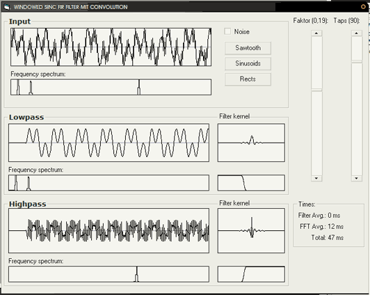



## FIR filters and convolution

### Description

This demo shows how to compute a low/highpass FIR filter and use it on a time-domain signal trough convolution.

It also shows frequency spectrum of the filter kernel and the filtered signal.
 
### More Info
 

             |
---                |---
**Submitted On**   |2008-01-02 11:10:02
**By**             |[Arne Elster](https://github.com/Planet-Source-Code/PSCIndex/blob/master/ByAuthor/arne-elster.md)
**Level**          |Intermediate
**User Rating**    |5.0 (45 globes from 9 users)
**Compatibility**  |VB 5\.0, VB 6\.0
**Category**       |[Math/ Dates](https://github.com/Planet-Source-Code/PSCIndex/blob/master/ByCategory/math-dates__1-37.md)
**World**          |[Visual Basic](https://github.com/Planet-Source-Code/PSCIndex/blob/master/ByWorld/visual-basic.md)
**Archive File**   |[FIR\_filter209599122008\.zip](https://github.com/Planet-Source-Code/arne-elster-fir-filters-and-convolution__1-69862/archive/master.zip)

